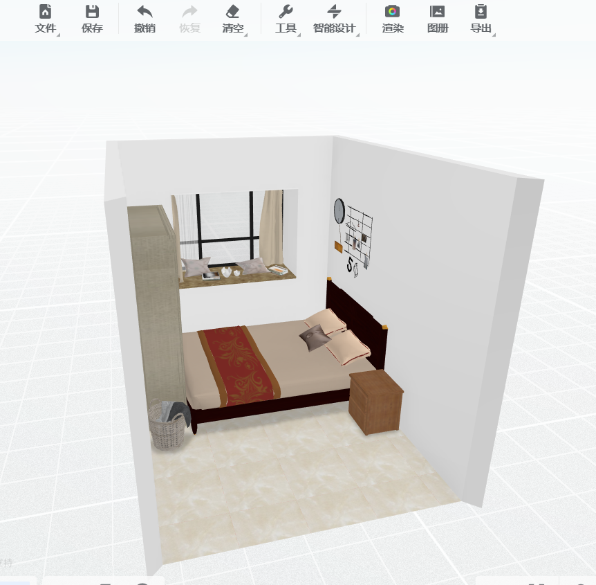

# 居住装修

> 大家都喜欢那句:房子是租来的,但生活不是.我的观点是:一切装饰改变请衡量代价,各种选择付出的代价最后都由自己来承担

## 装修的核心

> 这是从网上很多大佬的建议中总结的关键点,很惭愧我没有装修好自己的屋子

* 提前征得房主同意的基础上修改,尽量避免投入过大以及不可撤销的更改
* 硬装是关键,墙壁干净后,什么也不做会好看很多.房屋色调要统一,提前想好三种不冲突的色调搭配
* 软装:什么都展示出来的屋大多是很繁杂不好看的.遵从收纳二八原则(将不常用的\不美观\琐碎的收纳起来,仅展示常用与美观的)

## 大环境(硬装)

墙壁干净是很重要的:墙壁的处理方法有以下几种:

* 粉刷(个人害怕有有害物质,不敢采用)
* 壁纸贴,贴前确认是否是半永久,避免与房东退租金时发生扯皮事件
* 摄影布与墙布遮挡

地板:看个人喜好,与地面整洁程度

* 部分铺设地毯
* 用小朋友常用的拼合板
* 地板革

## 房屋内饰(软装)

### 家具装饰

建议如非必要,不要买新的,我担心搬家的时候会哭的.

如果有家具,但比较破旧,可以考虑用`贴纸` `刷漆` `桌布`,让它重获新生

常用的家具

* 桌子

* 懒人沙发

* 置物架

* 转角架

* 置衣架

  

### 摆放饰物

* 个性化门帘
*  铁丝网置物架
* 与环境搭配的收纳盒
* 脏衣篓
* 透光窗帘
* 床头灯
* 好看的餐盘

## 直男装饰记录

 	我实习租的房子到期的时候,简直是迫不及待的想要换房子.之前房子位于厨房旁边,朝向北.真的是一言难尽,发霉有油污味.租房的最佳日期是1到12月,最差日期就是5到7月,因为这段时间有大量毕业生进入社会.房子价格上涨\争夺激烈.我在找房子的时候,有几个就是刚约好去看就被抢走了,最后找到的房子只能说是马马虎虎.

未搬入时的照片没有了,只能画个简笔图来稍微展示一下了
.

在当时我的一腔热血下,脑子一热就决定了处理方式:

墙壁硬改费心费事,还很容易对身体有害.直接用之前背景布盖一下就好了

* 打扫干净后床靠门,

* 衣柜靠近窗户一边的墙,

* 窗户附件可以找机会弄张电脑桌.

  收拾完的效果图为:

简易收拾完后发现了几个问题,

* 没有工具量长度,导致床头长度过长,门再也无法关上了.
* 过道有些狭窄-只有80cm左右宽
* 窗户附近的空间有些小,放了桌子后放椅子会很挤
* 直接利用窗户当做桌子的想法不现实,因为窗户有些过高了,很难找到合适的椅子.

> 做错了大不了推到重来,不能一直让自己心里拧巴.

基于以上的错误,我决定推到重新来过.购买了量尺,测好了房间与房间物体的具体尺寸.我的房间房屋长：340cm
房屋宽：250cm,也就是8平米左右.

根据已有的数据信息,通过网上的工具 [库家乐](https://www.kujiale.com/) 做设计图,拖动生成的方式对我这种小白太友好了.(木有广告费,我我只知道这个软件) 设计图纸初步完成

直男审美完成的设计图就是这样了.我的准则是:尽量不购入大物,能省心就省心.因为我穷且怕麻烦.

**按照设计图完善装饰**

> 开始按照设计骨架图与自己心中所想收拾屋子,收拾完屋子的效果图如下

门外放了鞋架与垃圾桶,门上挂了免打孔窗帘,因为空调在客厅.为了光凉快一直开着门不好

窗台增加了一块装饰布,遮盖了大理石台板
原有的窗帘很脏,购买了免打孔的伸缩杆,在透光纱布与遮光布中犹豫很久后选择了遮光布
感觉床头上面很空,就闲鱼本地买了两个铁丝网与小彩灯,未来可以在铁丝网上挂照片

墙上是我网上买的遮盖布,用来遮盖住大块留白,地上是之前搬家带来的瑜伽垫.也在犹豫是否要购入泡沫板或沙发垫,感觉自己对他们的购买欲望不够强烈就搁置购买了.
窗户的遮盖布是原房东留下的,洗了洗还能用,暂时没心思换掉.
买的桌布还未到,床头柜就一直是不太好看的原木色

**添置物品**

| 物品名称            | 价格 | 说明                    |
| ------------------- | ---- | ----------------------- |
| 不锈钢厨房s挂钩30个 | 13   | 用来挂在铁丝网上        |
| 纳米透明胶          | 12   | 插座沾墙上,未来可能沾灯 |
| 免打孔伸缩杆115-200 | 16   |                         |
| 遮光窗帘*2          | 20   |                         |
| 免洗ins桌布         | 9    | 未到的一块桌布          |
| 20个透明挂钩        | 6    | 用来固定铁丝网与墙布    |
| 4层鞋架             | 13   |                         |
| 窗框卡扣式晾衣架    | 17   |                         |
| 网红星星灯          | 12   |                         |
| 北欧脏衣篓40*30cm   | 7    |                         |
| 免打孔沾贴          | 23   |                         |

**之前就有的物品**

| 物品                 | 价格 | 说明                     |
| -------------------- | ---- | ------------------------ |
| 觉先生酒店枕头       | 10   | 两个枕头中比较松软的一个 |
| 魔术贴束线器         | 3    |                          |
| 觉先生冰丝三件套     | 29   |                          |
| 海浪样式桌布70*150cm | 16   |                          |
| 狮子ins墙布          | 23   |                          |
|                      |      |                          |
|                      |      |                          |
|                      |      |                          |
|                      |      |                          |

